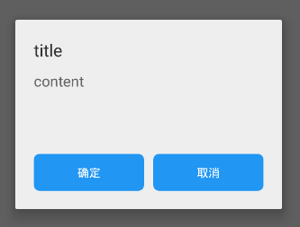
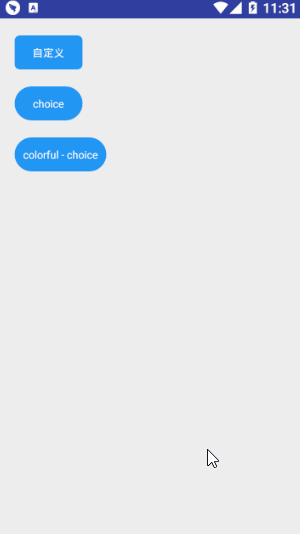

## alert
!> **功能弹窗，可以在页面上突出显示你所想要的内容**

>使用方式：

```kotlin
class AlertActivity : MainActivity(),AlertContentListener {
    //在窗口关闭之前可以运行想要的功能
    override fun beforeDismiss() {}
    //在弹窗窗口弹出后，可实现想要数据填充显示，或者窗口控制等，防止了在窗口显示前的调用出现空指针
    override fun contentViewEvents(view: View,dialog: DialogFragment) {
        view.findViewById<View>(R.id.yes).setOnClickListener { dialog.dismiss() }
    }
    override fun getLayoutId(): Int = R.layout.alert_sample
    override fun initView() {
        show_normal_alert.setOnClickListener {
             KuiAlert.instance(DialogModel(R.layout.alert_self_content, 0),this)
                     .show(supportFragmentManager,"tag")
        }
    }
```

**说明：**

可以在默认所有的activity或fragment中进行构建，构建必须实现**AlertContentListener**来完成回调任务。其使用的核心API为：
```kotlin
KuiAlert.instance(DialogModel,AlertContentListener)
```

DialogModel为输入给alert的对象，实现参数传递，其api为：

``` kotlin
/**
 * 自定义alert 构建对象
 * @param  layoutId 自定alert填充布局
 * @param  styleId 自定义alert xml属性样式
 */
data class DialogModel(@LayoutRes val layoutId:Int,@StyleRes val styleId:Int)
```

可以注入任意的布局文件，以及任意的style，来自主的构建自己想要的alert。

> **KuiChoiceAlert**

**说明：KuiChoiceAlert为KuiAlert 的自定义双按钮方案，其图如下图所示：**



**使用初始化**

```kotlin
//普通初始化显示
KuiChoiceAlert.instance
                .setTitle("标题")
                .setContent("提示内容")
                .initCallback({
                 //确定回调
                        },{
                 //取消回调
                        }).build().show(supportFragmentManager,"flag")


//全套初始化显示
 KuiChoiceAlert.instance
                    .setTitle("title")
                    .setContent("content")
                    .setTitleColor(Color.GRAY)
                    .setContentColor(Color.LTGRAY)
                    .setPositiveText("okay")
                    .setPositiveButtonColorful(ColorResButton())
                    .setNegativeText("cancel")
                    .setNegativeButtonColorful(ColorResButton())
                    .initClickDismiss(true)
                    .initCallback({
                        //确定回调
                         },{
                        //取消回调
                    }).build().show(supportFragmentManager,"tag")


```

> Fun

| FunctionName                                                | Remark                                                           |
| ----------------------------------------------------------- | ---------------------------------------------------------------- |
| setTitle (text:String)                                      | 设置title文字                                                    |
| setTitleColor(res:@ColorInt Int)                            | 设置title字体颜色                                                |
| setContent (text:String)                                    | 设置content文字                                                  |
| setContentColor (@ColorInt res:Int)                         | 设置content字体颜色                                              |
| setPositiveText (text:String)                               | 设置okay 按钮的文字内容                                          |
| setPositiveButtonColorful (colorResButton : ColorResButton) | 设置okay button 的样式 【详见ColorResButton】                    |
| setNegativeText (text:String)                               | 设置cancel 按钮的文字内容                                        |
| setNegativeButtonColorful(colorResButton : ColorResButton)  | 设置cancel button 的样式 【详见ColorResButton】                  |
| initClickDismiss (isClickAllDismiss : Boolean )             | 设置是否点击主窗口关闭整个弹窗                                   |
| initCallback ( okCallback:()->Unit,cancelCallback:()->Unit) | 设置回调函数，okCallback为点击确定按钮，cancelCallback为点击取消 |

!> **ColorResButton: **
```kotlin
/**
 * 建立自定义button颜色值
 * @param textColor 文字颜色
 * @param bgColor 背景或线条颜色
 * @param rippleColor 点击水波纹颜色
 * @param isStroke 是否是镂空
 */
data class ColorResButton(@ColorRes var textColor:Int = android.R.color.white
                        ,@ColorInt var  bgColor:Int = Color.rgb(33,150,243)
                        ,@ColorInt var rippleColor: Int = Color.BLACK
                        ,var isStroke: Boolean = false)
```

> 效果图：

