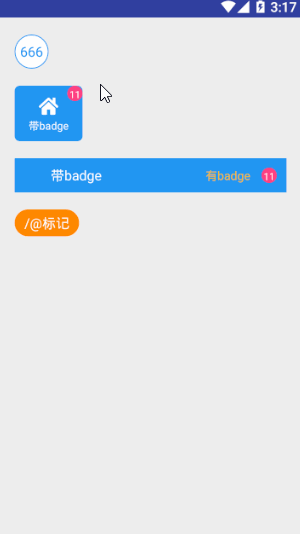

## badge
!> **可以提示着重显示标识或者提示标签徽章。**

>使用方式：

```xml
      <com.stormkid.kui_base.badge.KuiBadge 
                                          android:layout_width="@dimen/dp_40"
                                          android:layout_height="@dimen/dp_40"
                                          app:bg_style="circle"
                                          android:text="666"
                                          android:id="@+id/badge"
                                          app:badge_stroked="true"
                                          android:textColor="@color/primary"
                                         />
```

```kotlin
    override fun initView() {
        badge.setDragCallback {

        }
    }
```

!>**默认的badge是无法实现触摸滑动消失的，要么在xml中设定: ```app:is_dragging="true"``` 要么直通过id使用方法：```setDragCallback```**

说明：由于badge是继承于textview的，具体可直接使用textview相关语法内容，此处不再赘述，故textColor，textSize可直接通过textView中的方法来完成。

>Attr

| AttrName      | Type      | DefultValue | Remark                                                     |
| ------------- | --------- | ----------- | ---------------------------------------------------------- |
| bg_style      | enum      | radius      | badge背景类型，一般默认为带圆角背景【radius/circle/round】 |
| badge_bgColor | resource  | resource    | badge背景色，镂空状态下为边框颜色                          |
| badge_radius  | dimension | 3dp         | badge背景圆弧半径                                          |
| badge_stroked | boolean   | false       | 是否镂空                                                   |
| is_dragging   | boolean   | false       | 是否启动badge滑动消失                                      |

>Fun

| FunctionName                        | Remark                                                |
| ----------------------------------- | ----------------------------------------------------- |
| isStroke (isStroke: Boolean)        | 是否镂空                                              |
| isDragging(isDragging:Boolean)      | 是否启动滑动消失                                      |
| setBgColor(@ColorInt color: Int)    | 设置badge背景颜色                                     |
| setRadius(radius:Float)             | 设置badge倒角圆弧尺寸                                 |
| setDragCallback(callback: ()->Unit) | 设置badge回调方法，只要有此回调则必会触发滑动消失功能 |

--------------------------


>效果图：

