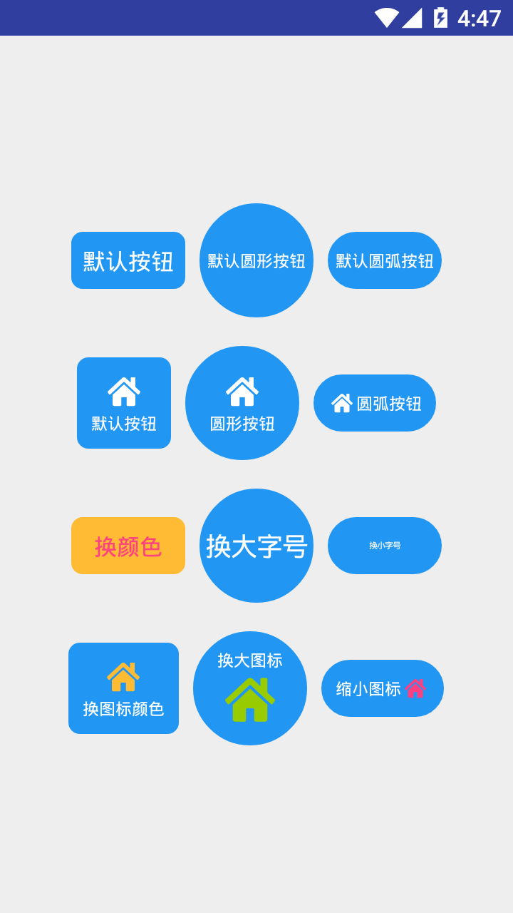

## button
!> ** 点击事件的承载者，触发事件来完成对业务逻辑的状态进行处理**

**使用方式：**
> 默认按钮：

```xml
   <com.stormkid.kui_base.button.KuiButton  android:layout_width="@dimen/dp_80"
                                            app:text="默认按钮"
                                            app:text_dimen="@dimen/sp_14"
                                            android:layout_height="@dimen/dp_40"/>

```

> 默认圆形按钮：

```xml
 <com.stormkid.kui_base.button.KuiButton android:layout_width="@dimen/dp_80"
                                            app:bg_drawable="circle"
                                            app:text="默认圆形按钮"
                                            android:layout_margin="@dimen/dp_10"
                                            app:text_dimen="@dimen/sp_10"
                                            android:layout_height="@dimen/dp_80"/>
```
!>**注意：圆形按钮需要指定宽高相等，切勿使用wrap_content**

> 默认圆弧按钮：

```xml
    <com.stormkid.kui_base.button.KuiButton android:layout_width="@dimen/dp_80"
                                            app:bg_drawable="round"
                                            app:text="默认圆弧按钮"
                                            app:text_dimen="@dimen/sp_10"
                                            android:layout_height="@dimen/dp_40"/>
```

> 默认带icon按钮：

```xml
 <com.stormkid.kui_base.button.KuiButton android:layout_width="wrap_content"
                                                app:text="默认按钮"
                                                android:id="@+id/click_right"
                                                app:icon_res="@drawable/ic_home"
                                                app:text_dimen="@dimen/sp_10"
                                                android:layout_height="wrap_content"/>
```
!> **直接输入icon的res即可显示图标按钮**

> 镂空按钮：

```xml
   <com.stormkid.kui_base.button.KuiButton android:layout_width="wrap_content"
                                                app:text="镂空方按钮"
                                                app:is_stroke="true"
                                                app:bg_color="@android:color/holo_orange_light"
                                                app:icon_res="@drawable/ic_home"
                                                app:icon_color="@android:color/holo_orange_light"
                                                app:text_dimen="@dimen/sp_10"
                                                app:text_color="@android:color/holo_orange_light"
                                                app:bg_radius="0px"
                                                android:layout_height="wrap_content"/>
```
!> **在镂空状态下设置按钮背景其实是边框颜色，背景色统一透明**


> Attrs

| AttrName  | Type | DefultValue    | Remark  |
|-------|---|-----------|-------|
| icon_dimen  | dimention | 28dp     | 图标宽高 |
| icon_res | resource  | 0     | 图标资源   |
| icon_color  | resource   | white | 图标颜色     |
| icon_gravity | enum  | TOP     | 图标相对于文字的方向【TOP/LEFT/RIGHT/BOTTOM】   |
| text  | string   | "" |  button的文字     |
| text_dimen  | dimention   | 13sp |   button文字的字号大小   |
| text_color  | resource   | #fff | button文字颜色   |
| bg_drawable  | enum   | radius | button背景类型，一般默认为带圆角背景【radius/circle/round】 |
| ignore_padding  | boolean    | false | 是否取消默认间距     |
| bg_color  | resource   | resource |  button背景色    |
| bg_radius  | dimension   | 5dp |  button圆弧半径     |
| is_stroke  | boolean   | false | 是否镂空     |


> Fun

| FunctionName|Params  | ParamsType    | Remark  |
|-------|-----|------|-------|
| setText | text  | String    |  设置button文字 |
| setTextSize | size  | Float    | 设置button字体大小  |
| setTextColor | res  | @ColorRes Int    | 设置button字体颜色  |
| setIconRes| imgRes  | @DrawableRes Int    |  设置图标资源  |
| setIconDimen| dimen  | Float    | 设置图标资源  |
| setIconResColor| src,res  | @DrawableRes Int,@ColorRes Int    | 当is_right_text="true"的时候控制右侧小标题文字点击事件  |
| setRadius | dimen  | Float    | 设置button倒角圆弧尺寸  |
| setBgType | bg  | Int    | 设置背景类型【radiusType,cicrleType,roundType】 |
| setBgColor | bgColor  | @ColorInt Int | 设置backgroundColor |


------------------------


>效果图：

