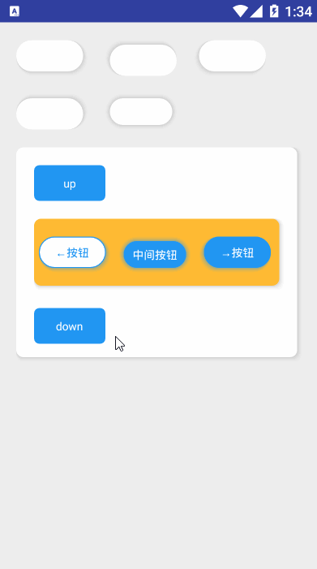

## card

!> **material 设计典范控件，含有阴影，光照等特殊效果，让页面焕然一新，并且变的好看，让界面有种设计感**

>使用方式：

```xml
    <com.stormkid.kui_base.card.KuiCard android:layout_width="match_parent"
                                        android:orientation="vertical"
                                        android:layout_marginTop="@dimen/dp_20"
                                        android:layout_height="wrap_content">
                                        ...
                                        </com.stormkid.kui_base.card.KuiCard>
```

**说明：由于KuiCard继承于LinearLayout,所以可以指定orientation 和 weight来更好的控制布局的显示。可在上面代码中的'...'处增加任意控件或者布局，其用法同LinearLayout。**

> Attrs

| AttrName       | Type      | DefultValue                 | Remark                                                                                        |
| -------------- | --------- | --------------------------- | --------------------------------------------------------------------------------------------- |
| card_radius    | dimention | 8dp                         | card的圆弧                                                                                    |
| card_bg        | color     | Color.WITHE                 | card的背景色，默认为白色                                                                      |
| card_shade     | resource  | android.R.color.darker_gray | card阴影颜色                                                                                  |
| is_card_button | boolean   | false                       | 是否是带阴影的按钮                                                                            |
| evel           | dimention | 1dp                         | 阴影高度                                                                                      |
| text_dimen     | dimention | 13sp                        | button文字的字号大小                                                                          |
| shape_mode     | enum      | RIGHT_AND_BOTTOM            | card背景阴影光照模式【LEFT_AND_TOP / LEFT_AND_BOTTOM/RIGHT_AND_TOP / RIGHT_AND_BOTTOM / ALL】 |
| padding        | dimention | 0dp                         | card 内间距                                                                                   |
| padding_left   | dimention | 0dp                         | card 内左间距                                                                                 |
| padding_right  | dimention | 0dp                         | card 内右间距                                                                                 |
| padding_top    | dimention | 0dp                         | card 内上间距                                                                                 |
| padding_bottom | dimention | 0dp                         | card 内下间距                                                                                 |
> Fun

| FunctionName                            | Remark                                                                                                     |
| --------------------------------------- | ---------------------------------------------------------------------------------------------------------- |
| setCardBg(@ColorInt color: Int)         | 设置card背景颜色                                                                                           |
| setCardShadeColor(@ColorInt color: Int) | 设置card阴影颜色                                                                                           |
| setEvel(dimen:Float)                    | 设置阴影高度（高度越高，阴影越大）                                                                         |
| isButton(isButton:Boolean)              | 是否是card button                                                                                          |
| setRaduis(radius:Float)                 | 设置card圆弧                                                                                               |
| setMode(mode:Int)                       | 设置card的投影模式有：SHAPE_LEFT_TOP、SHAPE_LEFT_BOTTOM、SHAPE_RIGHT_TOP、SHAPE_RIGHT_BOTTOM、ALL 同attr。 |


!> **CardButton**

>说明：可以通过调用KuiCard的isButton方法让Card变为KuiButton，可以使用KuiButton的全部属性！

>使用方式：

```xml
      <com.stormkid.kui_base.card.KuiCard android:layout_width="@dimen/dp_80"
                                                app:is_card_button="true"
                                                app:card_radius="@dimen/dp_20"
                                                android:id="@+id/card_button"
                                                android:layout_height="@dimen/dp_40"/>
```
!>**必须通过调用buttonView()方法获取kuiButton对象，并且拥有KuiButton的全部属性系数可调**

```kotlin
    fun initView(){
        card_button.buttonView().setText("←按钮")
        card_button.buttonView().setTextColor(R.color.primary)
        card_button.buttonView().setStroke(true)
        card_button.buttonView().setRippleColor(Color.CYAN)
        card_button.setOnClickListener {  }
    }

```

>效果图

 
