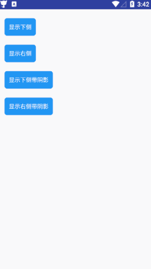

## pop

!> **一种简单的弹出窗口，可以定位到对应页面控件下弹出，弹出显示弹窗**

>初始化：

##### 1、实现PopwindowListener 如：

```kotlin
    class PopActivity:MainActivity(),PopwindowListener {
    override fun TouchView(view: View) {//TODO 通过id来控制popwindow中的内容 }
```

##### 2、直接使用：

```kotlin
   /**
    * 简单使用 
    */
     fun initView() {
        parent_view.setOnClickListener {
            KuiPop(KuiPop.PopParams(this,R.layout.pop_show),this).show(parent_view)
        }
     }
```
说明： 初始化必须构建**KuiPop.PopParams**这个数据类需要传递的参数为：```(context:Context,@LayoutRes layoutId:Int)```。**show(view:View)**方法为指定popwindow显示在view下方。

```kotlin
   /**
    * 全套使用    
    */
    fun initView() {
        parent_view.setOnClickListener {
            KuiPop(KuiPop.PopParams(this,R.layout.pop_show),this)
                    .isGravityLocation(false)
                    .needBg(false)
                    .show(parent_view,KuiPop.RIGHT)
        }
    }
``` 

> Fun

| FunctionName                       | Remark                                |
| ---------------------------------- | ------------------------------------- |
| isGravityLoaction(boolean:Boolean) | 指定是否显示在该控件下方              |
| needBg(boolean:Boolean)            | 是否需要该控件背景显示阴影            |
| show(view:View)           | 默认显示此popwindow在指定控件的下侧 |
| show(view:View,flag:Int)           | 显示此popwindow在指定控件的右侧或下侧 |

>效果图

 