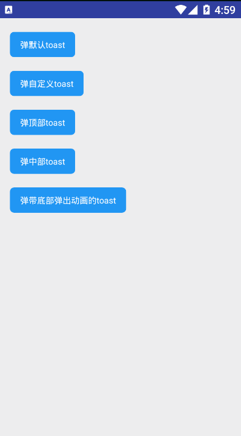

## toast
!> **一款自定义显示文字提示信息组件，可以很方便获取程序给予用户的提示信息，并且隔离了点击事件，滑动事件，防止重复弹窗**

>使用：

##### 1、直接使用

```kotlin
      KuiToast(context).showToast("弹出普通toast",KuiToast.LENGTH_SHORT)
```

##### 2、自定义使用

```kotlin
      KuiToast(this).BuildToast()
                    .setBlock(true).setDrawable(KuiToast.ROUND)
                    .setToastColor(ContextCompat.getColor(this,R.color.primary))
                    .setTextColor(R.color.primary).initToast()
                    .showToast("弹出自定义toast",KuiToast.LENGTH_SHORT)
```

说明：自定义创建时，需要调用initToast才能够使用showToast方法

> Fun

| FunctionName                       | Remark                                                                                               |
| ---------------------------------- | ---------------------------------------------------------------------------------------------------- |
| setGravity(gravity:Int)            | 指定toast显示在哪里【KuiToast.TOP/KuiToast.CENTER】,如果不使用此方法，则在底部弹出                   |
| setBlock(isBlock:Boolean)          | 是否toast样式镂空                                                                                    |
| setToastColor(@ColorInt color:Int) | 设定toast背景色，如果是block镂空样式则设定的是镂空样式                                               |
| setDrawable(flag:Int)              | 显示toast样式形状：【KuiToast.ROUND/KuiToast.CIRCLE/KuiToast.NORMAL】三种，即圆弧，椭圆，圆角的toast |
| needBottom(isNeed:Boolean)         | 设定是否使用底部弹出动画【true为底部弹出动画，默认为false】                                          |
| setTextColor(@ColorRes color: Int) | 设置toast文字颜色                                                                                    |
| setIsAutoDissmiss(isAuto:Boolean)  | toast是否自动消失，【如果为false，则必须点击屏幕toast才能消失，默认为true】                          |


>效果图

 