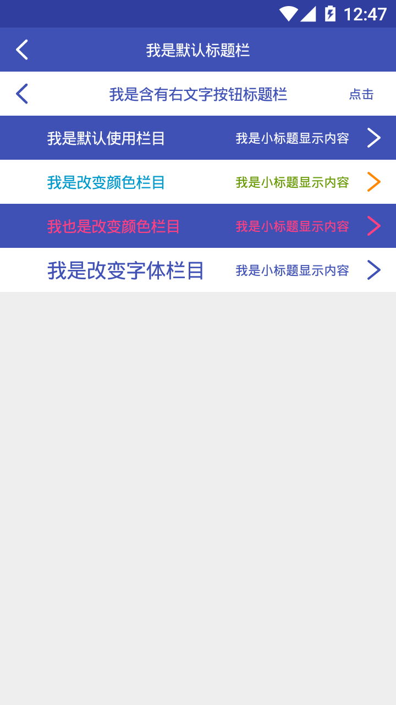

## toolbar

!> 一种简易多功能条目，可以变成navbar也可以直接使用在项目中

**使用方式：**
> 标题栏

```xml
 <com.stormkid.kui_base.toolbar.KuiToolBar android:layout_width="match_parent"
                                            app:title_text="我是默认标题栏"
                                            android:background="@color/colorPrimary"
                                            app:title_color="@android:color/white"
                                            app:left_image_icon="@drawable/ic_back"
                                            android:layout_height="@dimen/dp_40"/>
```    

> 条目工具栏

```xml
    <com.stormkid.kui_base.toolbar.KuiToolBar android:layout_width="match_parent"
                                              app:title_text="我是默认使用栏目"
                                              android:background="@color/colorPrimary"
                                              android:foreground="?android:attr/selectableItemBackground"
                                              android:id="@+id/tool_title"
                                              app:title_gravity="LEFT"
                                              app:title_color="@android:color/white"
                                              app:is_nav_bar="false"
                                              app:content_text="我是小标题显示内容"
                                              app:content_color="@android:color/white"
                                              app:right_image_icon="@drawable/ic_right"
                                              android:layout_height="@dimen/dp_40"/>
```

> API

| AttrName  | Type | DefultValue    | Remark  |
|-------|---|-----------|-------|
| image_dimen  | dimention | 20dp     | 图标宽高 |
| left_image_icon | resource  | 0     | 左图标   |
| left_icon_color  | resource   | white | 左图标颜色     |
| right_image_icon | resource  | 0     | 右图标   |
| right_icon_color  | resource   | white | 右图标颜色     |
| title_text  | string   | "" | 主标题/主显示文字     |
| title_size  | dimention   | 14sp | 主标题/主显示文字字号     |
| title_color  | resource   | #666 | 主标题/主显示文字颜色     |
| title_gravity  | enum   | CENTER | 主标题文字位置【LEFT/RIGHT/CENTER】 |
| content_text  | string    | "" | 小标题文字内容     |
| content_size  | dimention   | true |  小标题文字字体大小    |
| content_color  | resource   | #999 |  小标题文字字体颜色     |
| is_nav_bar  | boolean   | true | 是否是标题栏     |
| is_right_text  | boolean   | false | 是否使用小标题当右侧点击功能按钮 |
---------------------


>效果图

 
